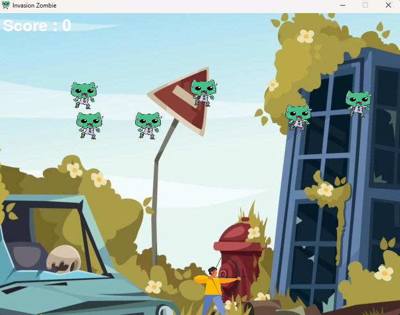

# Invasión Zombie

Invasión Zombie es un juego simple en el que el jugador controla a un arquero y debe eliminar a los zombies que se acercan. El objetivo es sobrevivir el mayor tiempo posible y obtener la puntuación más alta.

## Funcionalidad

El juego presenta las siguientes características:

- El jugador puede mover al arquero hacia la izquierda y la derecha utilizando las teclas de flecha del teclado.
- El jugador puede disparar flechas presionando la barra espaciadora. El objetivo es eliminar a los zombies con las flechas.
- Los zombies aparecen en posiciones aleatorias en la parte superior de la pantalla y se mueven hacia abajo. Si un zombie llega al final de la pantalla, se considera un fallo.
- Si una flecha impacta en un zombie, el jugador obtiene puntos y el zombie desaparece. Los zombies reaparecerán en nuevas posiciones después de ser eliminados.
- El juego termina cuando un zombie llega al final de la pantalla y se muestra un mensaje de "GAME OVER" junto con la puntuación final.
- El jugador puede ver la puntuación actual en la esquina superior izquierda de la pantalla durante el juego.

## Instalación

1. Asegúrate de tener instalado Python en tu sistema.
2. Clona este repositorio o descarga los archivos del juego.
3. Abre una terminal y navega hasta la ubicación del juego.
4. Instala las dependencias utilizando el siguiente comando: `pip install -r requirements.txt`
5. Ejecuta el juego con el siguiente comando: `python game.py`

## Requisitos del sistema

- Python 3.x
- pygame library

